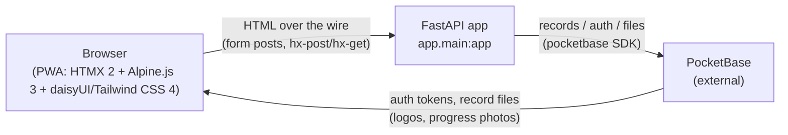
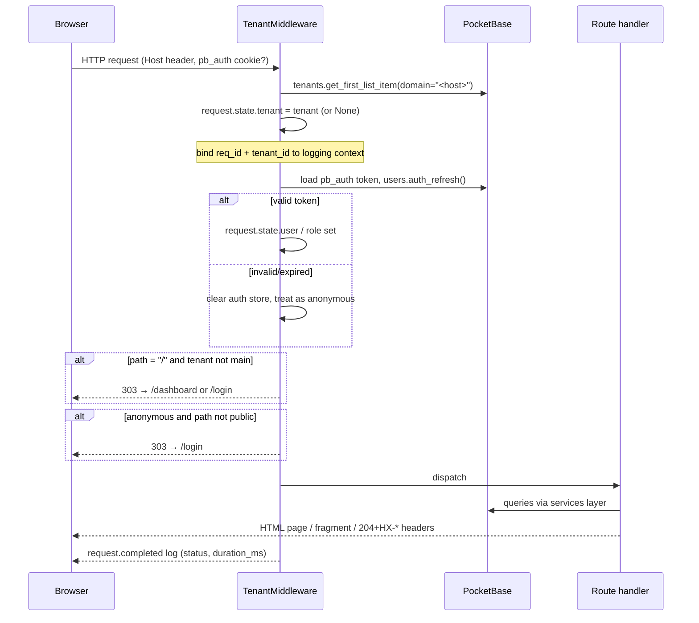
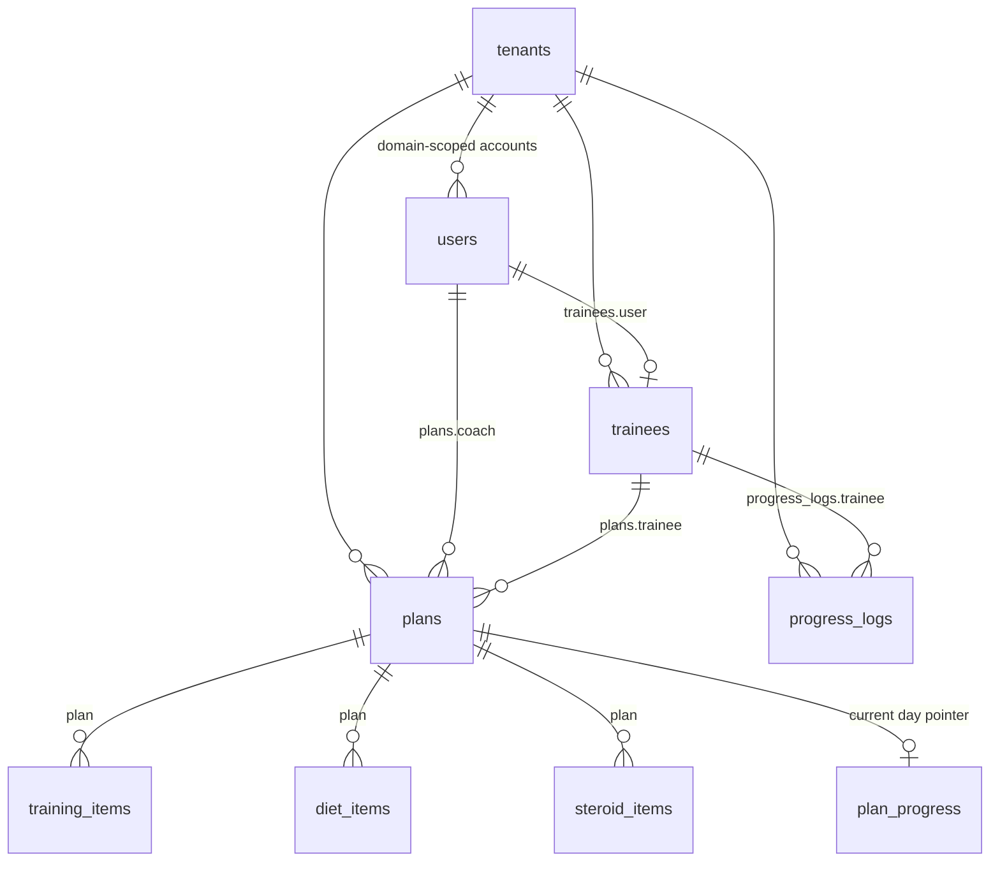

# 04 — Architecture

**Verification status:** everything here is derived from reading the current
source (`app/**`, `vite.config.js`, `Dockerfile`). Where behavior depends on
the external PocketBase instance (API rules, collection schema), it is marked.

---

## 1. System context

Gyme is a server-rendered web application. There is no SPA, no REST/JSON API
for the UI, and no client-side data store: the FastAPI backend renders HTML
fragments, and HTMX swaps them into the page. All persistence — records,
authentication, file storage — is delegated to an external **PocketBase**
instance over HTTP using the official Python SDK.



Component inventory:

| Layer | Location | Responsibility |
| --- | --- | --- |
| App assembly | `app/main.py` | Router registration, static mount, version, prod gating of docs/debug |
| Middleware | `app/middleware.py` | Tenant resolution, authentication, access logs |
| Routers | `app/routes/**` (+ `app/routes/user/**`) | HTTP endpoints; form parsing; HTMX header responses |
| Services | `app/services/**` | All PocketBase queries/filters and business rules |
| Templates | `app/templates/**` | base/layout/page/form/modal/component hierarchy (RTL Persian) |
| Template env | `app/templates.py` | Jinja2 environment + `jalali_date` / `jalali_year` filters |
| PB clients | `app/pb.py` | `PB_URL` config, `get_pb()` factory |
| Logging | `app/logging_config.py` | structlog pipeline with request context |
| Static assets | `app/static/**` | Vite-built `app.css`/`app.js`, workbox chunks, fonts, swagger assets |

## 2. Request lifecycle

Every request passes through exactly one middleware, `TenantMiddleware`
(`BaseHTTPMiddleware`), registered globally:



Step-by-step behavior (all verifiable in `middleware.py`):

1. A short `req_id` (8-char UUID prefix) is generated and attached to
   `request.state` and to the structlog context along with `tenant_id`.
2. The hostname (Host header without port) is looked up in the `tenants`
   collection by exact `domain` match. No match ⇒ `request.state.tenant = None`.
3. If a `pb_auth` cookie exists, the token is loaded into a fresh PocketBase
   client and validated via `pb.collection("users").auth_refresh()`. On any
   error (expired, revoked, password changed) the client treats the request as
   anonymous. The resolved user and its `role` (default `"trainee"`) go onto
   `request.state`.
4. Redirect rules:
   - `/` on a non-main tenant → `303` to `/dashboard` if authenticated else `/login`.
   - Any non-public path while unauthenticated → `303 /login`. Public paths:
     `/`, `/login`, `/static/*`, `/manifest.json`, `/sw.js`, `/favicon.ico`.
5. The request proceeds; start/end are logged as `request.started` /
   `request.completed` with method, path, role, status, duration. Exceptions
   are logged as `request.error` with traceback and re-raised.
6. Logging context is cleared at the end of the request.

**Consequence for operations:** every hostname served must exist in `tenants`.
Authenticated traffic to an unknown domain will pass the middleware but crash
in route handlers that dereference `request.state.tenant.id`; unauthenticated
traffic lands on the login page, and submitting login there yields the
«خطای سیستم: باشگاه یافت نشد!» toast (handled explicitly in `routes/auth.py`).

## 3. Authentication & session model

- **Credential check** happens only in PocketBase
  (`users.auth_with_password`) inside `services/auth.login_user`. After a
  successful password check, the user's `tenant` field is compared against the
  host-derived tenant id; mismatch ⇒ immediate logout-clear and failure
  («Invalid tenant access» logged as `login_cross_tenant_denied`).
- **Session transport** is the PocketBase auth token in an `pb_auth` cookie:
  `HttpOnly`, `SameSite=Lax`, `Secure=False` (hardcoded — see known issues).
  There are no server-side sessions; every request re-validates the token
  against PocketBase.
- **Account creation** (`services/auth.create_user`) sets the initial password
  equal to the email address, `emailVisibility=True`. This is why the create
  forms warn about duplicate/short emails (PocketBase enforces ≥8-char
  passwords).
- **Password change** (`POST /change-password`) validates confirmation +
  minimum length in the route, calls PocketBase's `oldPassword/password/
  passwordConfirm` update, then immediately re-authenticates with the new
  password and re-issues the cookie so the session survives.
- **Authorization** is coarse role-based routing, enforced in two places:
  - middleware: anonymous → `/login`;
  - routes: `user.role == "trainee"` redirects away from all owner/coach pages
    to `/user/dashboard`; non-trainees are redirected away from `/user/*` pages.
  - coach scoping happens in query construction: coaches see only trainees
    reachable through their own plans (`services/trainee.list_trainees`
    collects plan trainee ids for the current coach) and only their own plans
    (`routes/plan.py` forces `coach_id = user.id`).

There is no per-object ACL logic in the app beyond tenant scoping in query
filters; record-level security ultimately depends on PocketBase API rules
(**Unverified:** rules live in the instance, not in this repo). IDs are always
combined with a `tenant="..."` filter in service queries.

## 4. Data model

All collections live in PocketBase. Field lists below are reconstructed from
payloads and filters in the code (the schema itself lives in the PB instance):



| Collection | Fields used by the code | Notes |
| --- | --- | --- |
| `tenants` | `domain`, `name`, `logo` (file), `theme`, `brand_theme` (map rendered as CSS vars), `brand_colors` (`base_100`, `base_content`), `primary_color`, `is_main` | one record per served hostname |
| `users` (auth) | `email`, `password`, `first_name`, `last_name`, `phone`, `tenant`, `role` (`owner`/`coach`/`trainee`), `emailVisibility` | coaches *and* owners are plain users with roles; there is also a separate `coaches` reference in one query (see known issues) |
| `trainees` | `tenant`, `user`, `status` (`active`/`inactive`, default `active` on create), `gender`, `birthdate`, `blood_type`, `height`, `weight`, `training_history`, `steroid_history`, `supplement_history`, `limitations`, `notes` | list views expand `user` |
| `plans` | `tenant`, `type` (`training`/`diet`/`steroid`), `trainee`, `coach`, `start_date`, `end_date`, `days_per_week`, `status` (`active`/`inactive`; `draft` is counted by dashboard stats but not offered in the form), `notes`, `is_template` (bool), `template_name` | templates = rows with `is_template=true`; list views expand `trainee,coach,trainee.user` |
| `training_items` | `tenant`, `plan`, `name`, `category`, `seq` (day), `order`, `sets`, `reps`, `weight`, `rest_seconds`, `notes` | ⚠️ the HTTP layer currently drops `category` (known issue #2) |
| `diet_items` | `tenant`, `plan`, `meal_name`, `name` (food), `quantity`, `seq`, `order`, `notes` | |
| `steroid_items` | `tenant`, `plan`, `name`, `type` (`supplement`/`steroid`), `dosage`, `frequency`, `seq`, `order`, `notes` | |
| `progress_logs` | `tenant`, `trainee`, `height`, `weight`, `chest`, `waist`, `hip`, `arms`, `bmi`, `bfp`, `bmr`, `tdee`, `lbm`, `whr`, `notes`, `progress_photos` (files ≤5) | metrics computed client-side |
| `plan_progress` | `tenant`, `plan`, `current_seq` | one row per started plan; "Done" advances/wraps `current_seq` |
| `leads` | `name`, `phone`, `position`, `coaches_count`, `trainees_count`, `gym_name`, `note` | marketing landing form |

### Trainee "today" computation

The trainee dashboard (`routes/user/dashboard.py`) does not paginate by date;
it works on a per-plan **day pointer**:

1. Load the trainee's plans (`get_plans_by_trainee`), split by type into
   `training` / `diet` / `steroid` buckets.
2. For each plan, fetch its single `plan_progress` row (or assume seq 1).
3. Fetch items where `seq == current_seq` (`get_items_by_plan_seq`), sorted by
   `seq`,`order`.
4. Render those items grouped by `meal_name` (diet) or `category` (training).
5. `POST /user/plans/{id}/done` recomputes the sorted distinct `seq` list,
   advances to the next entry with wrap-around, updates/creates the
   `plan_progress` row, and answers with `HX-Refresh: true`.

## 5. Server ↔ browser interaction contract

Pages are enhanced with `hx-boost="true"` on `<body>` (normal navigation feels
instant). Mutations are HTMX requests that mostly return **empty bodies plus
headers**, interpreted by listeners registered in `base.html`:

| Mechanism | Emitted by | Effect |
| --- | --- | --- |
| `HX-Trigger-After-Swap: {"show-toast": {message, type}}` | `utils.hx_toast()` used by nearly every mutation | DaisyUI toast (info/success/error/warning), auto-dismisses after ~4 s |
| `HX-Trigger` with `delayed-redirect: {url}` | create/update/delete flows | JS listener navigates after ~500 ms so the toast stays visible |
| `HX-Trigger` with `closeModal` / `refreshList` / `performListRefresh` | modal forms (items, template apply, log edit) | closes dialog, refreshes underlying list |
| `HX-Redirect` | password change when unauthenticated, etc. | full-page navigation |
| `HX-Refresh: true` | trainee "done" button | reloads current page |
| partial renders | dashboard timeframe select targets `dashboard-content`; search/filter/trainee list swap table fragments | server returns component templates instead of whole pages |

A top progress bar animates on every HTMX request/beforeunload
(`htmx:beforeRequest` / `afterSettle` listeners in `base.html`).

## 6. Templates

```
base.html                     RTL shell, theme vars, offline banner, toast/redirect
│                             listeners, SW registration, iOS splash generator
├── layouts/dashboard.html    back button, tenant name/logo header, bottom dock
│   ├── pages/owner/…         dashboard, trainees(+detail), coaches(+detail),
│   │                         plans(+detail), profile
│   ├── pages/user/…          today dashboard, plans(+detail), profile
│   └── pages/auth/change_password.html
├── pages/auth/login.html     login card + iOS install overlay
├── pages/marketing/slash.html landing page (main tenant root)
├── forms/*.html              full-page create/edit forms (trainees, coaches,
│                             plans, progress_logs)
├── modals/*.html             HTMX-injected dialogs (items_form, apply_template,
│                             confirm_delete, progress_log_edit)
└── components/*.html         reusable fragments (dashboard_stats, coach_stats,
                              dashboard_content, toast, datepicker)
```

Jinja2 globals/filters: `app_version` global; `jalali_date` and `jalali_year`
filters convert PocketBase datetime strings (`YYYY-MM-DD[ HH:MM:SS(.f)]`,
optional trailing `Z`) to Jalali equivalents, falling back to the raw string
with a `date_parse_error` warning on bad input.

Theme resolution (`base.html`): `data-theme` = `light` if `tenant.theme ==
'custom'` else `tenant.theme` (default `gyme`); custom tenants may inject a
`:root { --var: value }` block from the `brand_theme` map.

## 7. Frontend build pipeline

- Entry: `app/static/main.js` imports `main.css`, registers `htmx`, `Alpine`,
  `SortableJS` globals and starts Alpine.
- Vite (`vite.config.js`): base `/static/`, Tailwind CSS 4 via
  `@tailwindcss/vite`; build outputs `app/static/app.js` (entry),
  `app/static/app.css` (CSS asset), fonts under `assets/[name]-[hash][extname]`;
  `emptyOutDir=false` so the service worker, workbox chunks and swagger assets
  survive rebuilds.
- Committed built artifacts mean the Python app runs without Node; Node is only
  needed to regenerate assets after class/template changes.

## 8. PWA internals

- `GET /manifest.json` (`routes/pwa.py`) builds a manifest per request from the
  tenant record: name/short_name = gym name; icons = tenant logo rendered
  through PocketBase thumb generator (`?thumb=192x192f` / `512x512f`) or
  fallback static icons; standalone portrait, dark background `#1d232a`,
  `start_url=/login`.
- `GET /favicon.ico` redirects to a 32×32 thumb of the tenant logo or the
  bundled favicon.
- `GET /sw.js` serves `app/static/sw.js` with `__CACHE_VERSION__` replaced by
  `APP_VERSION` (cache names embed the version, so deploying purges old
  caches); served with `Service-Worker-Allowed: /` and `Cache-Control:
  no-cache`.
- Service worker strategies (Workbox modules self-hosted under
  `/static/js/`):
  - same-origin css/js/font/json: StaleWhileRevalidate, max 60 entries /
    30 days;
  - images (any origin — covers PocketBase photo URLs): cache-first, add to
    image cache on success;
  - navigations/HTML: network-first; on failure fall back to cached copy of
    that URL, then cached `/offline/`, then an inline RTL offline response
    (503).
- `base.html` shows/hides the offline banner from `navigator.onLine` events and
  re-attaches it after HTMX body swaps via MutationObserver.
- iOS specifics: first-visit "Add to Home Screen" overlay (dismissal persisted
  in `localStorage`), and a canvas-generated `apple-touch-startup-image` built
  from the tenant logo/colors/name.

## 9. Logging & observability

- structlog configured once in `logging_config.py`: ISO UTC timestamps,
  log level + logger name, `req_id` and `tenant_id` merged from contextvars,
  pretty console renderer when `ENV=dev`, JSON renderer otherwise.
- uvicorn's access log is silenced (middleware emits richer lifecycle events);
  `httpx`/`httpcore` debug noise is clamped to WARNING.
- Event vocabulary examples: `login_success`, `login_cross_tenant_denied`,
  `auth_refresh_failed`, `request.started/completed/error`,
  `plan.list_pagination`, `template.apply_failed`,
  `progress_log.create_failed`, `item.delete_failed`.

If structlog import fails, `main.py` degrades to stdlib logging with a warning.

## 10. Configuration surface

Only two environment variables exist (see
[06-configuration-deployment.md](06-configuration-deployment.md)): `PB_URL` and
`ENV`. Feature gating done with them:

| Concern | dev (default) | production |
| --- | --- | --- |
| Swagger `/docs` + `/openapi.json` | available | removed (`docs_url=None` always; custom docs + schema gated on `IS_PROD`) |
| `/debug/*` routes | registered | router excluded AND its routes cleared defensively |
| Log rendering | console (pretty) | JSON |

## 11. Known structural quirks (summary)

Full analysis in [07-troubleshooting-known-issues.md](07-troubleshooting-known-issues.md);
architecture-relevant ones:

- Mixed PocketBase client usage: middleware and most routes use a per-request
  client from `get_pb()`, but `services/auth.py`, `services/tenants.py` share
  module-level singletons whose `auth_store` mutates during login — acceptable
  today because those paths don't rely on stored state afterwards, but it is a
  latent concurrency hazard.
- One query reads coaches from a `coaches` collection (`routes/plan.py`
  plan-list filter dropdown) while everywhere else coaches are `users` with
  `role="coach"`.
- `AGENTS.md` describes an older toolchain (Tailwind CLI scripts) than what
  `package.json` actually contains (Vite).
